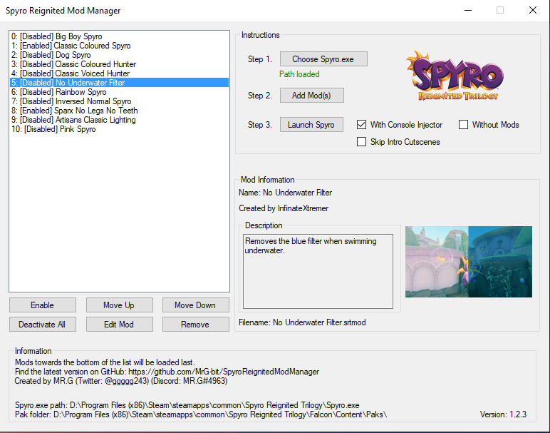

# Spyro Reignited Mod Manager

This program allows creating & managing multiple mod files for use with the Steam release of Spyro Reignited Trilogy. You can either import pakchunk files (*.pak*) or you can use pre-created Spyro mod files (*.srtmod*). The mods can be enabled or disabled so you can choose which you want active when playing the game. They can also be rearranged to specify a loading priority.

Mods can contain the following information: the name of the mod, creator of the mod, description of what the mod does, and a thumbnail to visually show the mod in action. If you want to share a mod that you made, you can export it as a shareable Spyro mod file. This version will be uneditable when loaded into the manager.

## Getting Started

It's simple and quick to set up the mod manager. Just follow the below steps and you'll be there in no time.

### Prerequisites

You will need a Steam version of Spyro Reignited Trilogy.

You can purchase Spyro on the [Steam Store](https://store.steampowered.com/app/996580/Spyro_Reignited_Trilogy/)

### Installing

Step one: Download the latest version of *Spyro Reignited Mod Manager.exe* above.

Step two: Launch the executable for first time setup.
* The executable will create two files: *data.dat* and a directory named *Spyro Reignited Mods*.

Step three: Click *Choose Spyro.exe* and navigate to your Spyro installation to select *Spyro.exe*
* E.g. *C:\Program Files (x86)\Steam\steamapps\common\Spyro Reignited Trilogy\Spyro.exe*

Now the program is ready to use!

### How To Use

Now that the program is installed, it's time to add some mods. You'll need to find some to use (either *.pak* or *.srtmod* files are compatible). They can be find on sites such as [Mod Database](https://www.moddb.com/games/spyro-reignited-trilogy/) or [Nexus Mods](https://www.nexusmods.com/spyroreignitedtrilogy). Once you have a mod file downloaded, follow the steps below depending on the type.

Adding a *.pak* file as a mod to the manager:
1. Click *Add Mod(s)* and select the pakchunk file(s) (*.pak*) you would like to add. Alternatively, you can drag & drop the file on the program.
2. A form will appear. Enter in details for the mod (a name is sufficient). You can tick *Delete .pak file* to delete the original *.pak* file as it won't be needed anymore.
3. Click *Confirm* and... That's it!

Adding a *.srt* file as a mod to the manager:
1. Click *Add Mod(s)* and select the Spyro mod file(s) (*.srt*) you would like to add. Alternatively, you can drag & drop the file on the program.
2. And... That's it!

Click *Enable* to activate the selected mod in the list. Now when you play Spyro, it will be modded. You can also click *Move Up* or *Move Down* to change the order in the list. This will affect the order that the mods are loaded by Spyro. Mods towards the bottom of the list will be loaded last.

You can create a shareable version of your mod either when adding it, or by clicking *Edit Mod* then *Create Shareable Copy*.

## Built With

* C# WinForms & Microsoft Visual Studio 2017

## Authors

* **MRG-bit** - *Developer* - [Twitter](https://twitter.com/ggggg243/)

## Acknowledgments

* Thank you Toys For Bobs for creating such an amazing game.
* Thanks to the members of the Spyro Reignited Modding Discord server that helped me.

## Additional Information

My anti-virus, Malwarebytes, returns a false-positive result: [MachineLearning/Anomalous.100%](https://blog.malwarebytes.com/detections/machinelearning-anomalous-100/) - which is based on a machine learning engine and heuristics. It is [known for providing false positives](https://forums.malwarebytes.com/topic/229840-false-positive-machinelearninganomalous100/)
