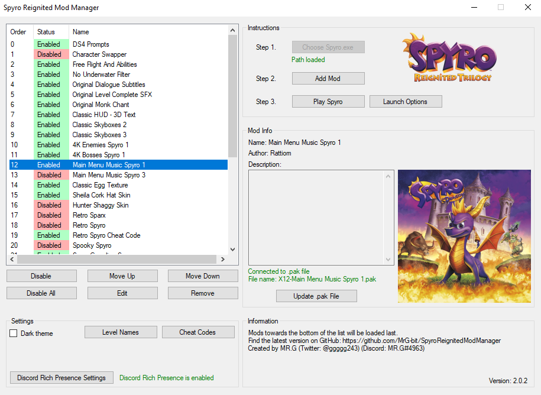
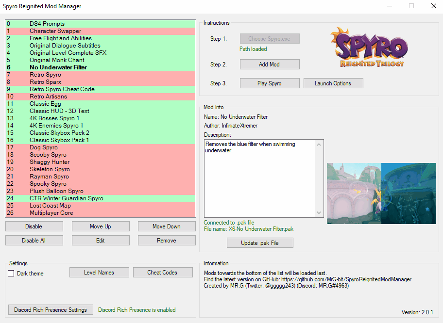

# Spyro Reignited Mod Manager

This program allows creating & managing multiple mod files for use with the Steam release of Spyro Reignited Trilogy. You are able to import pakchunk (*.pak*) files into the manager which are then converted into mods. The mods can be enabled or disabled so you can choose which you want active when playing the game. They can also be rearranged to specify a loading priority. Mods can contain the following information: the name of the mod, creator of the mod, description of what the mod does, and a thumbnail to visually show the mod in action.
  
[>> Download the lastest release <<](https://github.com/MrG-bit/SpyroReignitedModManager/releases/latest)
  
Features:
* Now supports mods of any size
* Discord Rich Presence implementation
* Dark theme mode
* Handy cheat code list

  
There are also various launch options: 
* running the game using the Console Injector which will enable the developer console. Note that if you choose to use the Console Injector launch option, you must [download](https://drive.google.com/file/d/1Z6SY-c7wbEPN9FsM-kZHiqtYbAsA6F2g/view) the program.
* skip the startup sequence (Toys For Bob, Activision & Unreal bumpers).
* backup the save file (sometimes mods can corrupt your save file).
  

## Getting Started

It's simple and quick to set up the mod manager. Just follow the below steps and you'll be there in no time.

### Prerequisites

You will need a Steam version of Spyro Reignited Trilogy.

You can purchase Spyro on the [Steam Store](https://store.steampowered.com/app/996580/Spyro_Reignited_Trilogy/)

### Installing

Step one: Download the latest version of *Spyro Reignited Mod Manager* above. Unzip it and extract the contents to a location of your choosing. Be sure to keep the three files together: *Spyro Reignited Mod Manager.exe*, *DiscordRPC.dll* and *Newtonsoft.Json.dll*.

Step two: Launch the executable for first time setup.
* The executable will create two files: *data.dat* and a directory named *mods*.

Step three: Click *Choose Spyro.exe* and navigate to your Spyro installation to select *Spyro.exe*
* E.g. *C:\Program Files (x86)\Steam\steamapps\common\Spyro Reignited Trilogy\Spyro.exe*

Now the program is ready to use!

### How To Use

Now that the program is installed, it's time to add some mods. You'll need to find some to use. They can be find on sites such as [Mod Database](https://www.moddb.com/games/spyro-reignited-trilogy/) or [Nexus Mods](https://www.nexusmods.com/spyroreignitedtrilogy). Once you have a mod file downloaded, follow the steps below.

Adding a *.pak* file as a mod to the manager:
1. Click *Add Mod(s)* and select the pakchunk file(s) (*.pak*) you would like to add.
2. A form will appear. Enter in details for the mod (a name is sufficient).
3. Click *Confirm* and... That's it!

Click *Enable* to activate the selected mod in the list. Now when you play Spyro, it will be modded. You can also click *Move Up* or *Move Down* to change the order in the list. This will affect the order that the mods are loaded by Spyro. Mods towards the bottom of the list will be loaded last.

## Built With

* C# WinForms & Microsoft Visual Studio 2019

## Authors

* **MRG-bit** - *Developer* - [Twitter](https://twitter.com/ggggg243/)

## Acknowledgments

* Thank you Toys For Bobs for creating such an amazing game.
* Thanks to the members of the Spyro Reignited Modding Discord server that helped me.

## Source Code

The project source code is provided. Please feel free to browse it.

## Additional Information

My anti-virus, Malwarebytes, returns a false-positive result: [MachineLearning/Anomalous.100%](https://blog.malwarebytes.com/detections/machinelearning-anomalous-100/) - which is based on a machine learning engine and heuristics. It is [known for providing false positives](https://forums.malwarebytes.com/topic/229840-false-positive-machinelearninganomalous100/)
